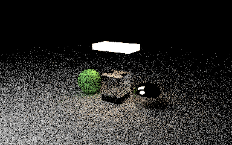
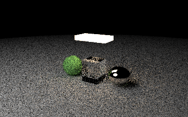
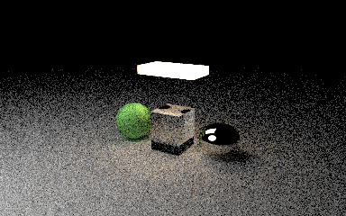
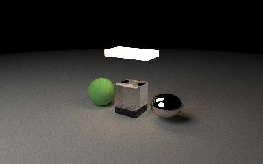
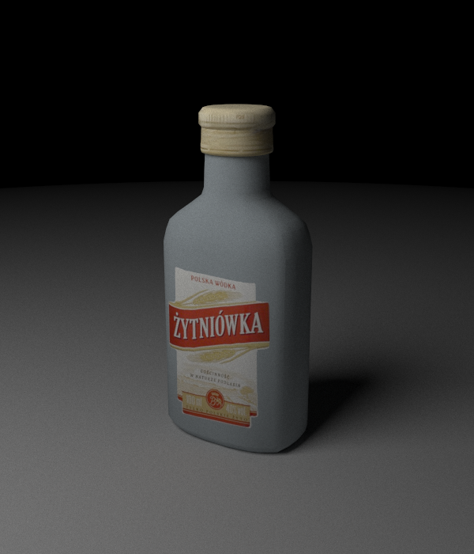
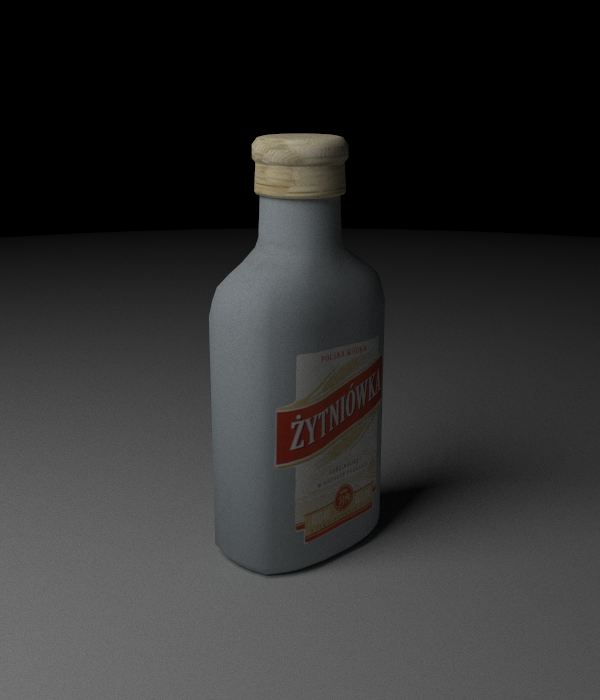
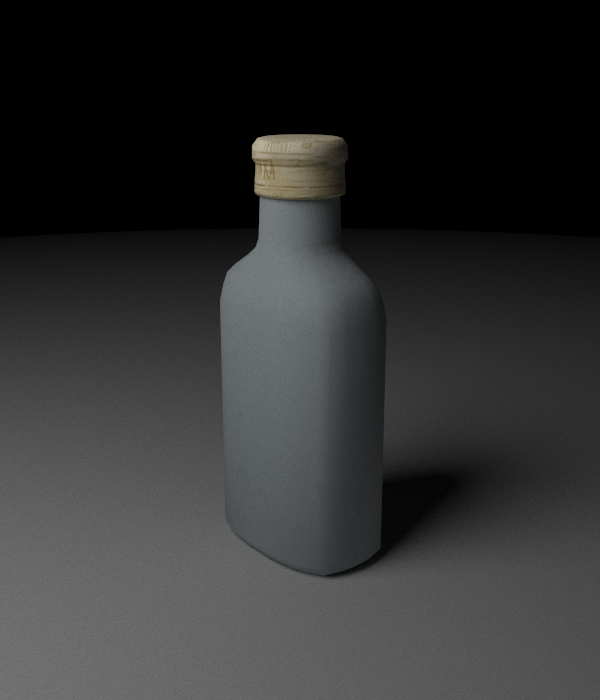
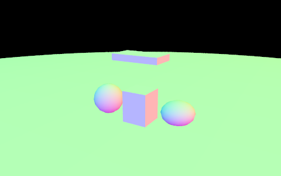
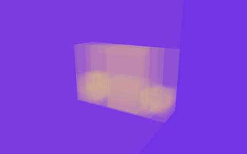

# CUDA Path Tracer

An interactive path tracer built with **C++17, CUDA, OpenGL and GLFW**. Import a
textured OBJ, orbit and pan around it, and watch a multi-bounce image converge as
samples accumulate. Rendering, random sampling, BVH traversal and pixel packing
run on the GPU; scene loading and BVH construction run on the host. Imported models
are staged with an automatic preview camera, floor and area light.


The project began as a CPU implementation based on
[Ray Tracing: The Next Week](https://github.com/RayTracing/raytracing.github.io).
Triangle meshes and OBJ import were added, and the existing BVH was flattened
for CUDA traversal. Both applications render with CUDA.

## Features

- **Multi-bounce light transport:** diffuse surfaces, reflective metal, dielectric
  reflection/refraction and emissive triangle or sphere lights.
- **Noise reduction:** explicit light sampling, cosine-weighted diffuse sampling
  and multiple importance sampling (MIS), plus progressive accumulation.
- **Triangle meshes:** Möller–Trumbore intersections, barycentric UVs, interpolated
  normals, polygon triangulation and material assignments.
- **OBJ/MTL import:** image textures, relative material/texture paths, and baked
  scale, rotation and translation. Models are automatically framed with a floor
  and an area light.
- **Custom BVH traversal:** the host-built tree becomes an indexed array;
  iterative CUDA traversal prunes nodes beyond the closest intersection.
- **Interactive camera:** right-drag orbit, horizontal/vertical pan, dolly,
  window resizing and accumulation reset when the view changes.
- **Diagnostic views:** surface normals, triangle IDs, material IDs, BVH box-test
  counts and primitive-test counts.

## Build and run

Requires an NVIDIA GPU supported by the installed CUDA toolkit, a compatible
NVIDIA driver, CMake 3.18+, and a C++17 compiler supported by that toolkit.
The viewer also requires GLFW 3.3+ and OpenGL 3.3 core. Image and OBJ loaders are
vendored; no dependency download is needed during the build.

On Ubuntu, install the host build/display dependencies:

```sh
sudo apt install build-essential cmake libglfw3-dev libgl1-mesa-dev python3
```

Install the CUDA toolkit separately and ensure `nvcc` is on `PATH`. Then, from the
project root:

```sh
cmake -S . -B build -DCMAKE_BUILD_TYPE=Release
cmake --build build -j
./build/ray_tracer_viewer
```

The default scene is the included textured Blender sphere. Open another model:

```sh
./build/ray_tracer_viewer --obj assets/models/gallery/gallery.obj
./build/ray_tracer_viewer --obj assets/models/vodka/vodka.obj
```

Render a still image:

```sh
mkdir -p output
./build/ray_tracer --obj assets/models/gallery/gallery.obj \
  --width 960 --height 600 --samples 256 > output/gallery.ppm
```

`--samples` controls the still image's total samples per pixel. In the viewer,
`--batch-samples` controls samples per frame; accumulation continues while the
camera is stationary. Higher values improve each frame's estimate but make camera
updates less frequent. The viewer starts at one sample per frame.

```sh
./build/ray_tracer_viewer --obj assets/models/vodka/vodka.obj \
  --width 900 --height 700 --batch-samples 4
```

For a build without a window system:

```sh
cmake -S . -B build-headless -DCMAKE_BUILD_TYPE=Release \
  -DRAY_TRACER_ENABLE_VIEWER=OFF
cmake --build build-headless -j
```

CUDA is required in both configurations. `--backend cuda` remains accepted for
older commands; other backend names are rejected. Use `--help` for all options.

### Display on WSL

`--display auto` uses a shared CUDA/OpenGL pixel buffer when supported and otherwise
copies CUDA-rendered RGBA pixels through host memory to OpenGL. The copy path is
validated on WSLg; direct sharing is unavailable on this setup. `--display copy`
selects that path explicitly. OpenGL reporting `llvmpipe` does not change where
path tracing runs: image generation still uses CUDA. Native direct interop has not
been validated on the available hardware setup.

### Controls

| Input | Action |
| --- | --- |
| Hold right mouse + drag | Orbit the current view center, horizontally and vertically |
| A / D | Pan left / right |
| Q / E | Pan down / up in the camera's image plane |
| W / S | Dolly toward / away from the view center |
| Shift | Faster movement |
| R | Restore the starting view |
| 1–6 | Shaded, normals, triangle IDs, material IDs, BVH cost, intersection cost |
| Escape | Release an active drag; otherwise close the window |

## Noise reduction

The default `--lighting mis` mode combines four implemented techniques:

| Technique | Implementation | Effect |
| --- | --- | --- |
| Explicit light sampling | Select a triangle or sphere emitter by surface area, sample a point, and trace a visibility ray | Diffuse surfaces can find small lights without waiting for a random continuation to hit one |
| Cosine-weighted diffuse sampling | Sample the hemisphere with density `cos(theta) / pi` in a local surface frame | Spend more samples on directions that contribute more to Lambertian reflection |
| Multiple importance sampling | Combine emitter and diffuse-direction samples with power-heuristic weights | Use both strategies without double counting the light paths they share |
| Progressive accumulation | Retain linear radiance sums and per-pixel RNG state across frames | A stationary view converges as new samples are averaged into the image |

The MIS power heuristic is `w(a,b) = a² / (a² + b²)`, where `a` and `b` are the
sampling PDFs expressed in the same solid-angle measure. Direct-light samples use
the light strategy's weight; emitter hits after diffuse continuation use the
complementary BSDF weight. The implementation scales the PDFs before squaring to
avoid unnecessary floating-point overflow or underflow. Directly visible lights
and lights reached immediately after specular scattering retain full emission.

### Equal-sample CUDA renders

These images use the same **472-triangle gallery, camera, 384×240 resolution,
seed 7 and 50-scatter limit**.

| Samples per pixel | Classic scattering | Direct-light sampling + MIS |
| --- | --- | --- |
| 8 |  |  |
| 32 |  |  |

**Reading the comparison:** equal samples do not mean equal rendering time; MIS
also traces shadow rays. Classic mode uses the retained `normal + random_in_ball`
diffuse sampler, whereas MIS uses cosine-weighted sampling. Their diffuse
sampling distributions can change brightness as well as noise, so this is a
comparison of the two implemented lighting modes, not an isolated variance test.
The lighting tests separately check the estimator against a numerical area
integral with a consistent diffuse model.

This **1,024-sample MIS image** shows continued convergence with the same scene, camera and seed:



Reproduce all five images (Pillow is used only for PNG output):

```sh
python3 examples/capture_noise.py
```

Or render either mode directly:

```sh
./build/ray_tracer --obj assets/models/gallery/gallery.obj \
  --lighting classic --width 384 --height 240 --samples 8 --seed 7 > output/classic.ppm
./build/ray_tracer --obj assets/models/gallery/gallery.obj \
  --lighting mis --width 384 --height 240 --samples 8 --seed 7 > output/mis.ppm
```

## Imported Blender model

The bottle below is a Blender-exported OBJ with **2,270 triangles**, smooth normals
and a base-color image. These are actual CUDA viewer framebuffer captures, rendered
at 600×700 with 1,024 samples per pixel and MIS. The object is rotated between
captures to show its front, side and back under the same preview lighting.

| Front | Side | Back |
| --- | --- | --- |
|  |  |  |

**Model:** [Delicious Polish vodka bottle](https://sketchfab.com/3d-models/delicious-polish-vodka-bottle-2527cdd4e465404a9e049171f506fc14)
by [Marcin.Kwiatkowski](https://sketchfab.com/Marcin.Kwiatkowski),
[CC BY 4.0](https://creativecommons.org/licenses/by/4.0/).
The asset paths and diffuse tint were adapted for this repository; see
[full attribution](assets/models/vodka/ATTRIBUTION.md).
The bottle uses opaque diffuse shading here. Its original opacity, normal,
roughness, metallic and AO maps are not applied.

**Why the bottle is not transparent:** its MTL declares `illum 2`, which the importer
maps to a diffuse material, and `map_d textures/M_vodka_opacity.jpeg`, which is not
yet consumed by the shader. `Ni 1.5` supplies an index of refraction but does not
select glass by itself. The gallery's center cube uses `illum 7` and exercises the
implemented dielectric reflection/refraction path. Changing the bottle's single
material to `illum 7` would make the entire material glass, including the label and
cap, and bypass its base-color texture. Faithfully reproducing the original model
requires separate glass/label/cap assignments or a richer texture-controlled
material model. Texture-controlled transparency is planned below.

### Export a model from Blender

1. Apply the object's scale and rotation, and apply any geometry modifiers needed
   in the exported mesh. Check the model's normals and UV unwrap.
2. Bake procedural/node-based surface colors to an image if necessary. Connect the
   base-color image to the material; arbitrary Blender shader graphs do not export
   to this renderer.
3. Export **Wavefront OBJ** with normals, UV coordinates and materials enabled.
   Export with Y up and −Z forward; triangulate faces for predictable topology.
4. Save the `.obj`, `.mtl` and textures together, using relative file paths.
5. Run `./build/ray_tracer_viewer --obj path/to/model.obj`.

A portable asset folder looks like this:

```text
model/
├── model.obj        # mtllib model.mtl
├── model.mtl        # map_Kd textures/base_color.png
└── textures/
    └── base_color.png
```

`mtllib` paths are relative to the OBJ; texture paths are relative to the MTL that
contains them. Renaming an OBJ does not update its `mtllib` line. On Linux,
filenames are case-sensitive, and `.jpg` and `.jpeg` are different names. A Windows
absolute texture path must be replaced with the asset's actual relative path.
When splitting a shell command across lines, end the continued line with `\`.

Optional import transforms apply scale, then X/Y/Z rotation in degrees, then
translation. Nonuniform scaling uses inverse-transpose normals; mirrored scales
also correct winding:

```sh
./build/ray_tracer_viewer --obj assets/models/vodka/vodka.obj \
  --obj-scale 1 1 1 --obj-rotate 0 75 0 --obj-translate 0 0 0
```

### Material mapping

| MTL input | Rendered material |
| --- | --- |
| `Kd`, optionally `map_Kd` | Lambertian diffuse color or textured diffuse |
| `map_Kd -s`, `-o`, `-clamp` | UV scale, offset, and repeat/clamp |
| `illum 3`, `5`, `8` + `Ks` | Ideal reflective metal |
| `illum 4`, `6`, `7`, `9` + `Ni` | Dielectric with the specified refractive index |
| Nonzero `Ke` | Emissive surface; takes precedence over other modes |

The importer reports simplified shading properties. It does not reproduce Blender
Principled BSDF, transparency maps, normal/bump maps, roughness/metallic maps,
anisotropy or arbitrary shader nodes. Diffuse image values currently use normalized
8-bit RGB without an explicit sRGB-to-linear conversion; output uses a square-root
gamma approximation. It is a compact material model, not full PBR asset fidelity.

## Implementation

### GPU scene representation

The host builds triangles and the original recursive BVH. The exporter traverses
that hierarchy in depth-first order, retaining its split topology, bounds and leaf
order. It unwraps mesh/scene containers and converts source objects to indexed
records. A duplicated left/right leaf remains one exported child, referenced twice.

| Host representation | Uploaded representation |
| --- | --- |
| `bvh_node*` child links | `int32_t left, right` indexing `flat_node[]` |
| Triangle objects with virtual intersection methods | Position, normal and UV values in `flat_triangle[]` |
| Borrowed `material*` pointers | `material_id` indexing tagged `flat_material[]` records |
| Texture objects and owned image memory | Tagged texture records, image dimensions, byte offsets and an RGB byte array |
| Camera object | Image-plane vectors, basis, origin and lens/shutter values in `flat_camera` |

For example, a branch points into the node array while its leaves point into
separate primitive arrays:

```text
nodes[0] = branch   { left: 1, right: 2, bounds: ... }
nodes[1] = triangle { primitive: 0, bounds: ... } --> triangles[0]
nodes[2] = sphere   { primitive: 0, bounds: ... } --> spheres[0]
triangles[0].material_id = 3                     --> materials[3]
```

The transfer records are checked at compile time for standard layout and trivial
copyability. The host's `std::vector` objects are not uploaded: CUDA allocates and
copies each vector's **elements**, then builds a `scene_view` containing device
addresses. Rendering uses those arrays and type tags, with no host pointers or
virtual dispatch in the kernel. Material and texture caches preserve sharing;
a shared image is not copied once per face.

Validation runs before device access. It checks child/material/texture indices,
image byte ranges, finite values, parent/leaf bounds, cycles, reachability and the
maximum traversal depth. Source: [flat_data.h](src/flat/flat_data.h),
[flat_export.h](src/flat/flat_export.h),
[flat_validate.h](src/flat/flat_validate.h).

### Custom BVH traversal

CUDA uses an iterative walk with a **64-entry per-thread stack**. Pushing the right
child before the left preserves the source tree's traversal order. A closest hit
tightens the admissible interval, rejecting later bounds and primitives farther
than that intersection. `nextafterf` expands the upper limit by one representable
step so strict primitive tests still admit equal-distance candidates and preserve
the source BVH's tie behavior.

The builder is the existing host random-axis split implementation; traversal is
depth-first. No second GPU builder, SAH split scheme, near-child sorting, OptiX or
RT-core API is used. A stack-overflow flag provides a checked failure rather than
an out-of-bounds write. Source: [bvh.h](src/bvh/bvh.h),
[transport.h](src/renderer/transport.h).

### Persistent CUDA pixel state

A **16×16 thread block** covers neighboring pixels. Each thread loads its pixel's
PCG state and accumulated radiance, traces that batch's samples through complete
paths, and writes the updated state back. This is a megakernel: intersection,
scattering, direct lighting and path continuation execute in one kernel's control
flow, with up to 50 scattering events per sample.

- **One writer per pixel:** accumulation does not need floating-point atomics.
- **Independent PCG streams:** pixel IDs select streams, and states persist between
  batches. Splitting eight samples into `3 + 3 + 2` follows the same sample sequence
  as one batch of eight.
- **Persistent allocations:** geometry, BVH, materials, image bytes, radiance sums
  and RNG states stay on the device between frames. Camera movement resets pixel
  state while retaining the uploaded scene.
- **Device-side output conversion:** a separate kernel averages radiance and packs
  RGBA, reducing display transfer data to four bytes per pixel.
- **Reduced counter contention:** each pixel records its ray count; a shared-memory
  block reduction performs one atomic addition per block, rather than per ray.
- **Owned resources:** non-copyable buffer wrappers release CUDA allocations;
  allocation, copy, launch and synchronization errors are checked.

This design prioritizes straightforward ownership and reproducible sampling.
Secondary rays can diverge in their traversal, materials and path lengths; the
implementation does not claim to eliminate warp divergence. Source:
[cuda_renderer.cu](src/cuda/cuda_renderer.cu), [random.h](src/renderer/random.h).

### Mesh attributes and material behavior

OBJ position, normal and UV indices are gathered independently, preserving seams
and hard edges. Triangulated faces use Möller–Trumbore intersection. Barycentric
weights interpolate smooth normals and UVs; interpolated normals are normalized
and kept in the geometric normal's hemisphere. Triangle AABBs are padded and
expanded to representable floats, and slab tests explicitly handle parallel rays.

Import transforms bake scale, XYZ rotation and translation before building bounds.
Normals use the inverse transpose under nonuniform scale; mirrored transforms also
correct winding. Image lookup supports MTL-relative paths, UV scale/offset and
repeat/clamp. The flat material tag selects diffuse, metal, dielectric or emission
in the path loop. Dielectrics choose reflection or refraction using Schlick's
approximation and handle total internal reflection.

Source: [obj_loader.h](src/scene/obj_loader.h),
[mesh_transform.h](src/transforms/mesh_transform.h),
[flat_intersect.h](src/flat/flat_intersect.h),
[transport.h](src/renderer/transport.h). The [material mapping](#material-mapping)
section describes the supported import subset.

### Interactive accumulation

GLFW input updates a camera controller whose orbit center moves with panning.
Horizontal and vertical mouse deltas update independent angles; keyboard
translation scales with elapsed time. A changed camera resets accumulation so
samples from different views are not averaged together. Resize retains pose and
vertical field of view while replacing pixel buffers; debug changes also create a
fresh renderer. Unfocused or minimized windows pause work and discard stale input.

OpenGL presents the completed image on a fullscreen primitive. The application can
use a CUDA-registered pixel buffer or the WSL-compatible copy path. Screenshot
capture reads the actual OpenGL backbuffer before swapping, which lets tests check
presentation and orientation as well as rendered pixel values. Source:
[camera_controller.h](src/display/camera_controller.h),
[preview_session.h](src/display/preview_session.h),
[gl_display.h](src/display/gl_display.h),
[cuda_gl_display.cu](src/cuda/cuda_gl_display.cu).

### Diagnostic views

| Surface normals | BVH box-test heat map |
| --- | --- |
|  |  |

```sh
./build/ray_tracer_viewer --obj assets/models/gallery/gallery.obj --debug normals
./build/ray_tracer_viewer --obj assets/models/gallery/gallery.obj --debug bvh
```

The heat map encodes primary-ray traversal work on a logarithmic scale. It helps
locate overlapping bounds and expensive parts of a scene. The hero image uses
960×600 and 256 samples per pixel; the diagnostic captures use 16 samples per pixel.
To reproduce the material and bottle captures, install Pillow and run
`python3 examples/capture_gallery.py`; the noise images use
`python3 examples/capture_noise.py`.

## Tests

```sh
ctest --test-dir build --output-on-failure
python3 examples/validate_cuda.py --build build --sanitizer
```

Tests cover triangle edge cases, mesh transforms, OBJ/MTL failures, texture lookup,
BVH topology and bounds, GPU ray queries, MIS visibility, progressive batch
continuity, camera input, RGBA conversion and actual OpenGL captures. CUDA tests
return a distinct skip code when no device is accessible; skipped hardware tests
are not evidence of a successful device run.

The v1.0 viewer build passes 15 tests on Ubuntu 24.04 under WSL2 with CUDA 13.1,
GCC 13 and an RTX 4060 Laptop GPU. The optional direct
CUDA/OpenGL interop test is skipped because that platform cannot share the context.
CUDA memory, initialization, race and synchronization checks pass; six host geometry/import/transport suites also pass
AddressSanitizer, UndefinedBehaviorSanitizer and leak checks.

## What to do next

1. **Color management and richer materials.**
2. **Environment lighting and scene controls.**
3. **Wavefront Path Tracing**

## License and assets

Project code is [MIT licensed](LICENSE). Vendored source retains its
[upstream licenses](third_party/README.md). The bottle model, textures and rendered
bottle images are CC BY 4.0, with [attribution](assets/models/vodka/ATTRIBUTION.md).
The material gallery is a custom scene assembled from the project's sphere and
cube fixtures; its [generator](examples/generate_gallery.py) and
[scene description](assets/models/README.md#material-gallery-construction) explain
its geometry and material assignments.
